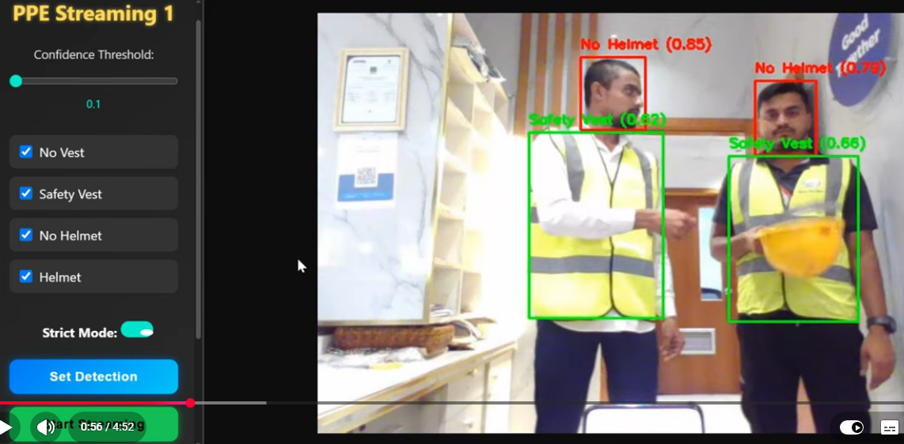

# OMNI PPE — Detección de EPP en vivo (ApexCorp)

> **Visión computacional · YOLO (SH17) · FastAPI · CUDA o CPU**

Estado: **v0.1.0 · prototipo funcional sobre video real de obra.**



Detecta por persona si lleva **casco, chaleco, lentes y guantes**, y muestra una
barra de cumplimiento que se pone **verde (LISTO)** al superar el umbral o
**roja (NO LISTO)** si falta algo.

Lo que responde: *¿puede esta persona entrar a la obra ahora mismo?* — una
pregunta que hoy contesta un vigilante mirando, persona por persona.

## Probarlo

```bash
pip install -r requirements.txt
python download_models.py          # SH17 yolo9e a weights/
uvicorn backend.main:app --port 8000
```

Copia tus `.mp4` a `videos/` y abre <http://localhost:8000>: elige el video,
ajusta la confianza y el EPP requerido, y pulsa **Iniciar**.

**Los pesos y los videos no están en el repositorio.** Son entrada, no código,
y pasan de los 100 MB que GitHub rechaza. `download_models.py` los recupera:

```bash
python download_models.py --list             # qué variantes hay
python download_models.py --variant yolo8m   # más rápida, algo menos precisa
python download_models.py --all              # + los modelos que compara compare.py
```

> ⚠️ SH17 es **CC BY-NC-SA 4.0 — no comercial**. Vale para este prototipo. Para
> una entrega comercial hay que cambiar de pesos (*Ultralytics construction-ppe*
> o un dataset propio de Roboflow); el código no cambia, solo `MODEL_WEIGHTS`.

## Cómo se calcula el porcentaje

Cada ítem detectado se asigna a la persona **que más lo contiene**, no a la más
cercana: dos operarios juntos harían que el casco de uno puntúe al otro. Luego
se suman los pesos de lo que sí lleva puesto.

| Ítem | Peso | Por qué |
|---|---|---|
| Casco | `0.45` | Casco + chaleco = `0.90`, por encima del umbral `0.80` |
| Chaleco | `0.45` | |
| Lentes | `0.05` | Suman, pero por sí solos no dejan pasar a nadie |
| Guantes | `0.05` | |

Tres detalles que la prueba `test_scoring.py` deja fijados:

- **Un casco en el suelo no cuenta como puesto.** Con modelos que solo detectan
  presencia se comprueba la geometría: la caja tiene que caer sobre la cabeza.
- **Un «sin casco» explícito gana a un «con casco» más flojo.** Si el modelo ve
  las dos cosas, manda la de más confianza.
- **Casco + chaleco tienen que seguir bastando** aunque alguien toque los pesos
  en el `.env`. Si no, nadie podría pasar nunca y no se notaría hasta la obra.

## Ajustes (`.env`)

| Clave | Para qué |
|---|---|
| `MODEL_WEIGHTS` | Ruta a los pesos (`weights/sh17_yolo9e.pt`) |
| `DEVICE` | `cuda:0` o `cpu` |
| `TARGET_FPS` | FPS de inferencia — bajarlo da fluidez, no precisión |
| `PPE_WEIGHT_*` | Peso de cada ítem |
| `READY_THRESHOLD` | Mínimo para «LISTO» (`0.80`) |
| `STRICT_MODE` | Exige **todos** los ítems requeridos, ignorando el porcentaje |
| `HELMET_ON_HEAD` | Comprueba que el casco esté sobre la cabeza |

## Cómo está montado

```
backend/
├── config.py     todo por variable de entorno, sin tocar código
├── registry.py   qué clase de cada modelo es qué ítem de EPP
├── detector.py   carga de pesos e inferencia
├── scoring.py    reparto de ítems por persona y cálculo del %  ← la lógica
├── streamer.py   MJPEG a fps controlado
└── main.py       API
frontend/         interfaz sin framework
compare.py        corre varios modelos sobre el mismo video y los compara
```

## Pruebas

```bash
python -m pytest test_scoring.py -q
```

Cubren `scoring.py`, que es la única parte que decide algo con consecuencias.
Un fallo del detector se ve en pantalla; un fallo en el reparto de ítems no —
solo sale un porcentaje que parece razonable y no lo es.

## Licencia

Código: uso interno de ApexCorp. Pesos SH17: CC BY-NC-SA 4.0, no comercial.

<sub>OMNI PPE · ApexCorp — desarrollado por
<a href="https://github.com/danielyatacoblas">Daniel Yataco Blas</a></sub>
