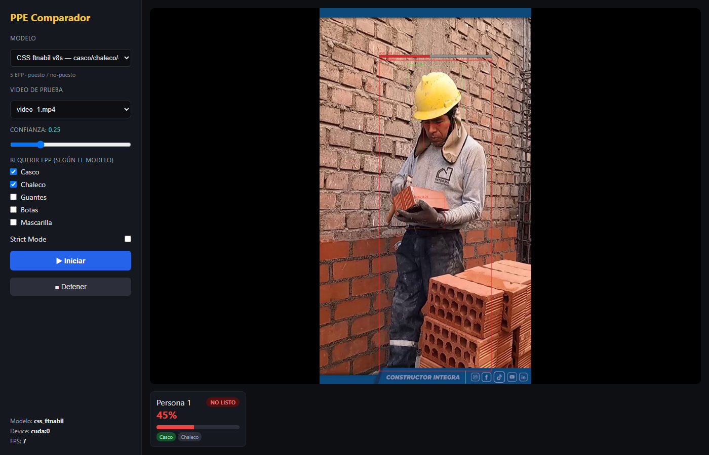
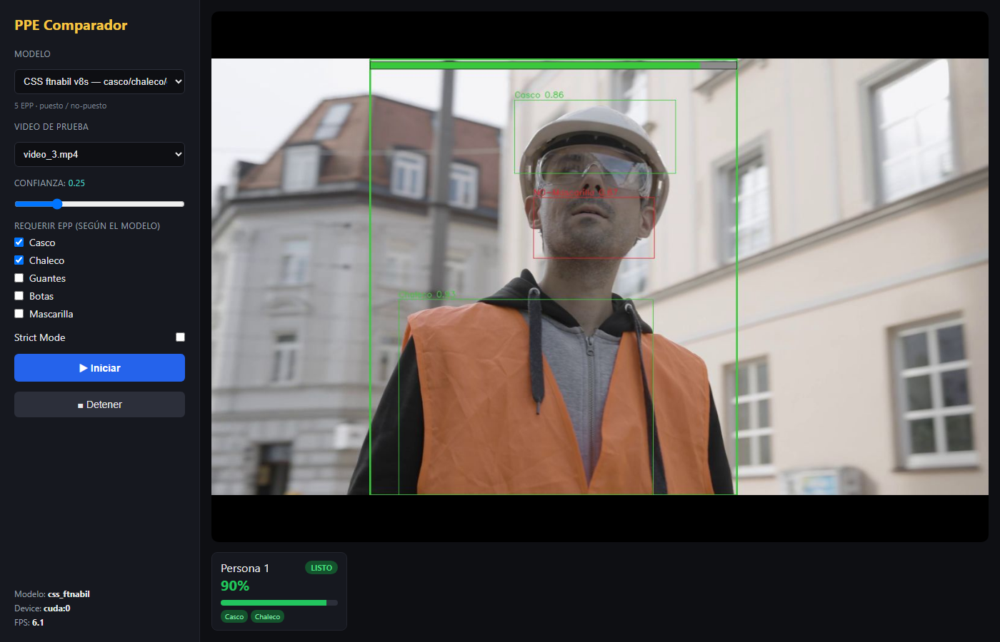
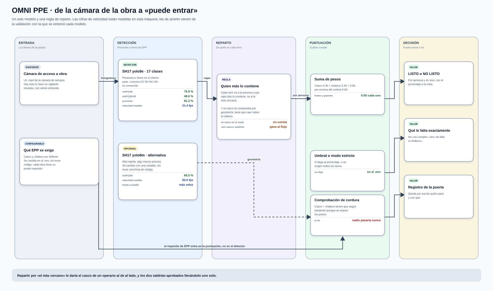
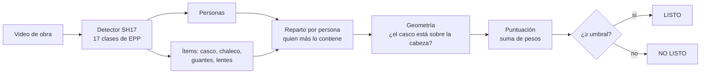
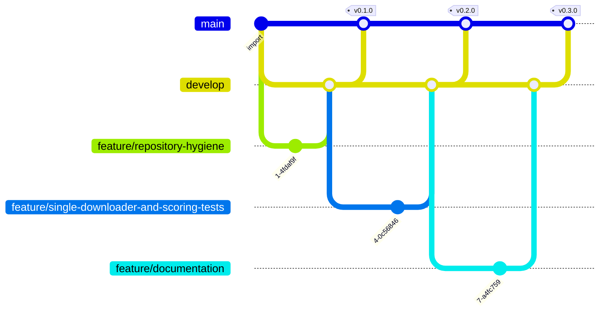

# OMNI PPE — detección de EPP en vivo

> **Visión computacional · YOLOv8/v9 (SH17) · FastAPI · CUDA o CPU**
>
> 
> 
> 
> 



## El problema

En la puerta de una obra hay alguien mirando si cada operario lleva casco y
chaleco. Lo hace de memoria, con prisa, y con veinte personas entrando a la vez.

OMNI PPE contesta una sola pregunta, por persona y en vivo: **¿puede entrar
ahora mismo?** Sale un porcentaje de cumplimiento y un verde o un rojo.

## Qué se ve

| | |
|---|---|
| **Cumplimiento por persona**<br><br><sub>casco sí, chaleco no → 45 %, NO LISTO</sub> | **Otro video de obra**<br><br><sub>el mismo cálculo sobre otra escena</sub> |

## Cómo funciona

<a href="docs/flujo.svg">
  
</a>

<sub>Ábrelo en grande: <a href="docs/flujo.svg"><code>docs/flujo.svg</code></a>.
Las cifras de las tarjetas no están escritas a mano — las pone
<a href="scripts/diagrama.py"><code>scripts/diagrama.py</code></a> leyendo
<code>docs/modelos.json</code>, que a su vez genera
<a href="scripts/medir_modelos.py"><code>scripts/medir_modelos.py</code></a>
midiendo los modelos de verdad. Si mañana se cambia un modelo, se corren los
dos y el dibujo se corrige solo.</sub>

### El mismo recorrido, en corto



**Cada ítem se asigna a la persona que más lo contiene, no a la más cercana.**
Con dos operarios juntos, «el más cercano» le da el casco de uno al otro y los
dos salen bien cuando solo uno lo lleva.

| Ítem | Peso | Por qué |
|---|---|---|
| Casco | `0.45` | Casco + chaleco = `0.90`, por encima del umbral `0.80` |
| Chaleco | `0.45` | |
| Lentes | `0.05` | Suman, pero por sí solos no dejan pasar a nadie |
| Guantes | `0.05` | |

Tres detalles que las pruebas dejan fijados:

- **Un casco en el suelo no cuenta como puesto.** Con modelos que solo detectan
  presencia se comprueba la geometría: la caja tiene que caer sobre la cabeza.
- **Un «sin casco» explícito gana a un «con casco» más flojo.** Si el modelo ve
  las dos cosas, manda la de más confianza.
- **Casco + chaleco tienen que seguir bastando** aunque alguien toque los pesos
  en el `.env`. Si no, nadie podría pasar nunca, y eso no se notaría hasta
  tener la cola en la puerta.

<!-- MODELOS:inicio -->

### Los modelos, medidos

| Modelo | Para qué | Entrada | Precisión | Recall | mAP@50 | mAP@50-95 |
|---|---|---|---|---|---|---|
| **`sh17_yolo9e.pt`** | EPP, 17 clases — el que usa la app | 640² | 81.2 % | 64.9 % | 70.9 % | 48.6 % |
| **`sh17_yolo8m.pt`** | EPP, variante más rápida | 640² | 77.8 % | 60.3 % | 66.5 % | 45.6 % |
| **`css_voxdroid.pt`** | Puesto / no puesto (comparador) | 640² | 95.2 % | 79.8 % | 87.8 % | 62.5 % |
| **`hafizqaim.pt`** | Puesto / no puesto (comparador) | 640² | 71.9 % | 71.4 % | 73.4 % | 45.6 % |

<sub>Estas cuatro columnas **no** se calculan aquí: salen del propio archivo `.pt`, donde Ultralytics guarda la validación del entrenamiento que produjo esos pesos. Son el acierto sobre el conjunto de validación de quien lo entrenó, **no** sobre los videos de este proyecto. Medir eso exigiría etiquetar a mano esta operación concreta, que es trabajo que un MVP todavía no ha hecho; dar un porcentaje inventado sería peor que no darlo. Comprobación de que la lectura es correcta: `yolo11n` sale con mAP@50-95 = 39,4 % y Ultralytics publica 39,5 % para ese modelo en COCO.</sub>

### De dónde sale cada modelo

| Modelo | Entrenado sobre | Épocas | Resolución | Origen |
|---|---|---|---|---|
| **`sh17_yolo9e.pt`** | `safe_human` | 200 | 640×640 | [SH17 · CC BY-NC-SA 4.0](https://github.com/ahmadmughees/SH17dataset) |
| **`sh17_yolo8m.pt`** | `safe_human` | 200 | 640×640 | [SH17 · CC BY-NC-SA 4.0](https://github.com/ahmadmughees/SH17dataset) |
| **`css_voxdroid.pt`** | `data` | 200 | 640×640 | Construction Site Safety · VoxDroid |
| **`hafizqaim.pt`** | `data` | 10 | 640×640 | Workspace Safety Detection · hafizqaim |

<sub>El conjunto, las épocas y la resolución salen de `train_args`, que Ultralytics guarda dentro del propio `.pt`. Es decir: no es lo que dice la documentación del modelo, es lo que quedó grabado en el archivo que este repositorio usa de verdad. Los nombres de conjunto son los del disco de quien entrenó —`retrain_data`, `safe_human`— porque es literalmente lo que hay dentro.</sub>

| Modelo | Parámetros | Clases | Latencia (mejor) | Latencia (mediana) | Det./fotograma | Confianza media |
|---|---|---|---|---|---|---|
| **`sh17_yolo9e.pt`** | 58.2 M | 17 | 44.6 ms · 22 fps | 50.7 ms · 19.7 fps | 6.7 | 0.762 |
| **`sh17_yolo8m.pt`** | 25.9 M | 17 | 20.0 ms · 50 fps | 23.5 ms · 42.6 fps | 5.7 | 0.819 |
| **`css_voxdroid.pt`** | 11.1 M | 10 | 15.6 ms · 64 fps | 19.1 ms · 52.4 fps | 3.9 | 0.791 |
| **`hafizqaim.pt`** | 3.0 M | 17 | 13.7 ms · 73 fps | 16.3 ms · 61.4 fps | 1.1 | 0.499 |

<sub>Esto sí se mide aquí, con <a href="scripts/medir_modelos.py"><code>scripts/medir_modelos.py</code></a>, sobre fotogramas reales de los videos del repositorio, en una RTX 3060 Laptop y a la resolución que usa la aplicación. Sesenta fotogramas, descartando los veinte primeros.<br>Se dan <b>dos</b> latencias a propósito. Esta GPU está a 210 MHz en reposo y tarda segundos en subir de reloj, así que la mediana se mueve bastante entre pasadas —el mismo <code>yolo11n</code> ha dado 20 y 48 fps— mientras que el mejor caso es estable y representa lo que la máquina puede sostener. Dar solo la cifra buena sería vender de más; dar solo la mediana, castigar al modelo por la gestión de energía del portátil.</sub>

<!-- MODELOS:fin -->

## Probarlo

```bash
pip install -r requirements.txt
python download_models.py                    # SH17 yolo9e
python -m uvicorn backend.main:app --port 8000
```

Copia tus `.mp4` a `videos/` y abre <http://localhost:8000>.

```bash
python download_models.py --list             # qué variantes hay
python download_models.py --variant yolo8m   # más rápida, algo menos precisa
python download_models.py --all              # + los modelos que compara compare.py
```

### Por qué los pesos y los videos no están aquí

No son código: son la entrada y la salida del sistema. Varios pasan de los
100 MB que GitHub rechaza de plano, y clonar el proyecto pasaría de segundos a
minutos para traerse archivos que se regeneran o se descargan.

```bash
python download_models.py          # los recupera y dice cuáles faltan
```

## Cómo está montado

```
backend/
├── config.py     pesos, umbral y dispositivo por variable de entorno
├── registry.py   qué clase de cada modelo es qué ítem de EPP
├── detector.py   carga de pesos e inferencia
├── scoring.py    reparto de ítems por persona y cálculo del %  ← la lógica
├── streamer.py   MJPEG a fps controlado
└── main.py       API
frontend/         interfaz sin framework
scripts/          generadores de las capturas y del diagrama de ramas
compare.py        corre varios modelos sobre el mismo video y los compara
```

## Ajustes (`.env`)

| Clave | Para qué |
|---|---|
| `MODEL_WEIGHTS` | Ruta a los pesos (`weights/sh17_yolo9e.pt`) |
| `DEVICE` | `cuda:0` o `cpu` |
| `TARGET_FPS` | FPS de inferencia — bajarlo da fluidez, no precisión |
| `PPE_WEIGHT_*` | Peso de cada ítem |
| `READY_THRESHOLD` | Mínimo para «LISTO» (`0.80`) |
| `STRICT_MODE` | Exige **todos** los ítems, ignorando el porcentaje |
| `HELMET_ON_HEAD` | Comprueba que el casco esté sobre la cabeza |

## Pruebas

```bash
python -m pytest -q          # 13, sin video ni modelos ni GPU
```

Cubren `scoring.py`, que es la única parte cuyo resultado tiene consecuencias:
decide si una persona entra a la obra. Un fallo del detector se ve en pantalla;
que los ítems se repartan mal entre personas **no se ve** — solo sale un
porcentaje que parece razonable y no lo es.

<!-- GITFLOW:inicio -->

## Cómo se trabajó

**10 commits**, **6 fusiones** y **3 etiquetas** (`v0.1.0`, `v0.2.0`, `v0.3.0`). al generar este bloque. Cada rama entra con `--no-ff`: un merge aplastado ahorra una línea y borra la única prueba de que aquello fue una tarea con principio y final.



| Prefijo | Para qué | Ramas |
|---|---|---|
| `feature/` | trabajo acotado, se integra en develop | 3 |
| `develop/` | rama de integración | 3 |

| Rama | Responsabilidad | Regla de salida |
|---|---|---|
| `main` | Lo que ve primero quien llega al repositorio | Solo recibe trabajo terminado y con las pruebas en verde |
| `develop` | Integración: aquí se junta todo antes de subir | Merge `--no-ff` desde una rama `feature/*` |
| `feature/*` | Un trabajo acotado, nombrado por lo que hace | Merge `--no-ff` a `develop` con sus pruebas escritas |

Los mensajes siguen *Conventional Commits* y están en inglés. Explican **por qué**, no qué: el *qué* ya está en el diff. Varios cuentan el fallo que arreglan y cómo se descubrió, que es lo que sirve dentro de seis meses.

<sub>El diagrama lo genera <a href="scripts/gitflow.py"><code>scripts/gitflow.py</code></a> leyendo <code>git log --merges</code>.</sub>

<!-- GITFLOW:fin -->

---

## Licencia

Código: uso interno de ApexCorp S.A.C. Pesos SH17: CC BY-NC-SA 4.0, no comercial.

<sub>OMNI PPE · ApexCorp S.A.C. — desarrollado por
<a href="https://github.com/danielyatacoblas">Daniel Yataco Blas</a></sub>
